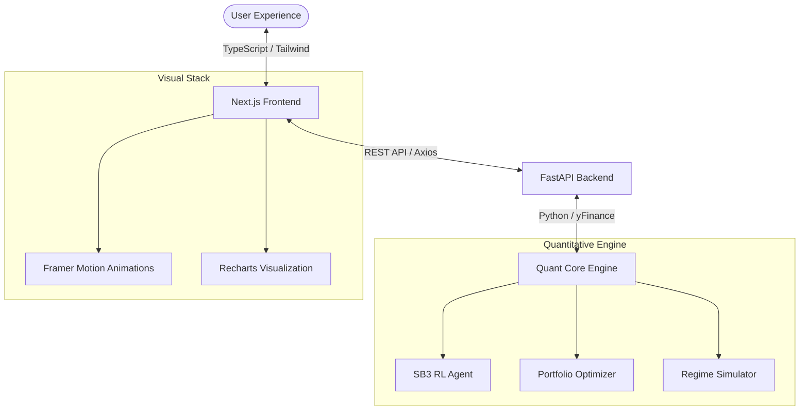

# QuantVision | AI-Driven Trading Strategy Studio 📈

QuantVision is an institutional-grade trading strategy optimization platform. It leverages Reinforcement Learning (Proximal Policy Optimization) to discover profitable trading signals on historical market data, compared against traditional financial benchmarks.

## 🏗️ System Architecture



## 🚀 Key Features

- **Startup Hub v3.0**: A professional, multi-tabbed dashboard for **Global Alpha Signaling**, **Portfolio Optimization**, and **Crisis Stress Testing**.
- **Neural Portfolio Optimization**: Automated asset allocation using **Modern Portfolio Theory (MPT)** to maximize the Sharpe Ratio across a custom universe.
- **Historical Stress Testing**: Specialized simulation of performance during major market regimes (2008 Crisis, 2020 COVID, 2022 Inflation).
- **Unlimited Asset Universe**: Pull real-time data for any global stock, ETF, or cryptocurrency via integrated Yahoo Finance search.
- **Institutional Risk Suite**: Real-time **Value at Risk (VaR)**, **Benchmark Beta**, and **Correlation Heatmaps**.

## 📁 Modular Project Structure

```text
├── src/
│   ├── core/       # RL Environment & Strategy Baselines
│   ├── data/       # Professional Data Pipeline (yFinance)
│   ├── features/   # Technical Indicator Engine
│   └── analysis/   # Metrics & Visualization Suite
├── models/         # Serialized RL Agents
├── app.py          # Streamlit Dashboard (Entry Point)
└── train.py        # Model Training Pipeline
```

## 🛠️ Installation

1. **Clone the repository**:
   ```bash
   git clone https://github.com/Sujataalegavi7/TradingStrategyOptimization
   cd TradingStrategyOptimization
   ```

2. **Install dependencies**:
   ```bash
   pip install -r requirements.txt
   ```

## 💻 Usage

### 1. Train the RL Agent
Run the training pipeline to generate a strategy for a specific ticker:
```bash
python train.py
```

### 2. Launch the Dashboard
View the results and compare against benchmarks in the interactive studio:
```bash
streamlit run app.py
```

## 📊 Evaluation Metrics
QuantVision evaluates strategies using:
- **Sharpe Ratio**: Risk-adjusted returns.
- **Sortino Ratio**: Returns adjusted for downside volatility.
- **Max Drawdown**: Portfolio "underwater" risk.
- **Equity Curve Comparison**: Visualizing RL performance vs. Buy & Hold.

---
*Developed for Portfolio Showcase. Built with Python, Stable-Baselines3, Plotly, and Streamlit.*
